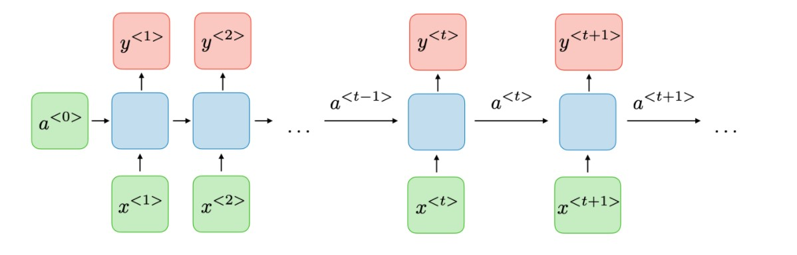

# Chapter 3: Long Short Term Memory
#### A deep dive into something most people will not even remember long or short term besides for the exam...
____

## Section 3.1: What are Recurrent Neural Networks?

### Introduction
Now that we have covered some of the basic machine learning algorithms, lets dive into one of the more complex and widely used
tools - a Long Short Term Memory Neural Network (LSTM). In this chapter, we will cover the following materials:
1) A brief overview of the super-category of Recurrent Neural Networks (RNN)
2) What makes a Long Short Term Memory Neural Net different from a typical RNN.
3) How do LSTM's work?
4) Code your own LSTM
5) How do LSTM's compare to other Machine Learning Algorithms
6) Potential Uses and Applications of LSTM's

### What are Recurrent Neural Networks?
To start with, what is a Recurrent Neural Network? First, let's define a neural network. This is a set of algorithms that function in a way that mimics a collection of neurons inside a human brain. There is an input, some calculations in the middle, and some output. The number of inputs, outputs and type of input/output (whether it is an image or music or text) varies per network, and your specific neural network can be customized to analyze whatever you want it to. The difference between a typical neural network and a *recurrent* neural network is that this structure also contains a way to persist some of the outputs from previous iterations into the input of the next iteration. This allows the neural network to essentially "remember" the past and form conclusions about what is to come based on what it has already seen.

Don't worry if this was all very confusing. The next few diagrams should lay it out step by step for you, and even if you do not fully or completely understand how the inner mechanics work, you should still be able to use the tool to create some very interesting results!

### History and Prior Applications of RNN's
Recurrent Neural Networks were developed in 1986 by David Rumelhart, a mathematical psychologist from Stanford University. You can read more about him here [Link to Personal Page](https://en.wikipedia.org/wiki/David_Rumelhart) and even read the original paper where this application is discussed in great detail here: [Link to paper](https://www.nature.com/articles/323533a0). This novel innnovation sparked a great deal of interest in applying this knowledge to many different fields. Within the turn of the century, scientists were starting to apply this to music composition, handwriting recognition, and even protein homology detection. It wasn't until 1997 that two European scientists created the LSTM as an improved and specialized version of the current RNN's. 

If you are interested in reading more, [here](https://ai.googleblog.com/2019/03/rnn-based-handwriting-recognition-in.html) is an article about how Google is using RNN's to develop handwriting recognition software. [Here](https://web.stanford.edu/class/archive/cs/cs224n/cs224n.1174/reports/2762076.pdf) is another interesting article detailing how RNN-assisted computer generated music fooled over 70% of human listeners.

### What is the structure of a Recurrent Neural Network?
This might seem scary at first, but do not feel intimidated by the complex math or the weird structures you might see. They are all simply a collection of inputs, outputs, and arrows that indicate the direction that information is flowing. With that in mind, let us look at a simple RNN set-up.

From the picture above, you can see that there is a basic input, an output, and some calculations that happen in between. 

The calculations are what makes this algorithm ultimately work, and we will be going into detail about what exactly those are later. The algorithm is simulated via nodes which contain the input (in green) some *blue* text, output (in red), and calculation (in blue) steps inside. As seen in the picture above, the arrow that leads from one computational node into the next computational node is what allows this recurrent neural network to have persistent memory and maintain information about past events. 

---

## Section 3.2: What is a Long Short Term Memory Neural Network?

### A supervised deep learning classification algorithm
Supervised deep learning classification algo. (define each and every term. What is supervised?? What is deep? What is classification?)

---
## Section 3.3 How do Long Short Term Memory Neural Networks actually work?

Math Function here? Maybe?
~Wes's section~

---

## Section 3.4 Code Walkthrough

~Callie's section~

---

## Section 3.5  Compare and Contrast

### What is difference between LSTM's and other RNN's?
type something here

### Comparison Chart

|Type of Machine Learning Algorithm| IDK Some column Here | Efficiency                |
|-----------|:----------------:|----:              |
|Morning    | Oreos!           | Delicious         |
|Afternoon  | Otter Pop        | It's hot out baby |
|Night      | IPA              | I need it. |

### Uses in Language Processing
It was used a lot in language processing. In the next section, we will show you other applications for it. :)

---
## Section 3.6 Uses of Long Short Term Memory

~Wes's section~
