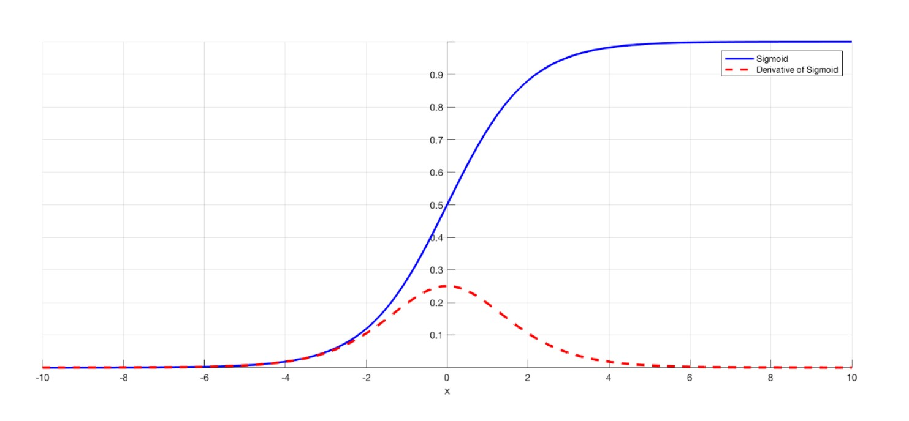
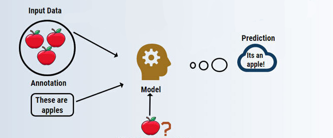
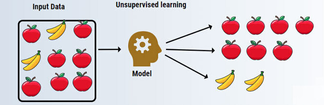

# Chapter 3: Long Short Term Memory
#### A deep dive into something most people will not even remember long or short term besides for the exam...
____

## Section 3.1: What are Recurrent Neural Networks?

### Introduction
Now that we have covered some of the basic machine learning algorithms, lets dive into one of the more complex and widely used
tools - a Long Short Term Memory Neural Network (LSTM). In this chapter, we will cover the following materials:
1) A brief overview of the super-category of Recurrent Neural Networks (RNN)
2) What makes a Long Short Term Memory Neural Net different from a typical RNN.
3) How do LSTM's work?
4) Code your own LSTM
5) How do LSTM's compare to other Machine Learning Algorithms
6) Potential Uses and Applications of LSTM's

### What are Recurrent Neural Networks?
To start with, what is a Recurrent Neural Network? First, let's define a neural network. This is a set of algorithms that function in a way that mimics a collection of neurons inside a human brain. There is an input, some calculations in the middle, and some output. The number of inputs, outputs and type of input/output (whether it is an image or music or text) varies per network, and your specific neural network can be customized to analyze whatever you want it to. The difference between a typical neural network and a *recurrent* neural network is that this structure also contains a way to persist some of the outputs from previous iterations into the input of the next iteration. This allows the neural network to essentially "remember" the past and form conclusions about what is to come based on what it has already seen.

Don't worry if this was all very confusing. The next few diagrams should lay it out step by step for you, and even if you do not fully or completely understand how the inner mechanics work, you should still be able to use the tool to create some very interesting results!

### History and Prior Applications of RNN's
Recurrent Neural Networks were developed in 1986 by David Rumelhart, a mathematical psychologist from Stanford University. You can read more about him here [Link to Personal Page](https://en.wikipedia.org/wiki/David_Rumelhart) and even read the original paper where this application is discussed in great detail here: [Link to paper](https://www.nature.com/articles/323533a0). This novel innnovation sparked a great deal of interest in applying this knowledge to many different fields. Within the turn of the century, scientists were starting to apply this to music composition, handwriting recognition, and even protein homology detection. It wasn't until 1997 that two European scientists created the LSTM as an improved and specialized version of the current RNN's. 

If you are interested in reading more, check out these two articles:
* [Article Here: ](https://ai.googleblog.com/2019/03/rnn-based-handwriting-recognition-in.html) This is an article about how Google is using RNN's to develop handwriting recognition software.
* [Scientific Paper Here: ](https://web.stanford.edu/class/archive/cs/cs224n/cs224n.1174/reports/2762076.pdf) This is another interesting research paper detailing how RNN-assisted computer generated music fooled over 70% of human listeners.

### What is the structure of a Recurrent Neural Network?
This might seem scary at first, but do not feel intimidated by the complex math or the weird structures you might see. They are all simply a collection of inputs, outputs, and arrows that indicate the direction that information is flowing. With that in mind, let us look at a simple RNN set-up.

This is a traditional set up, where at each time step, there is exactly one input and one output. There are other neural networks where there is only one input at all and the output of that step feeds into the input of the next step and yet others where there are many inputs and only one output at the last step. The structure and setup you choose will depend on what type of problem you are trying to solve. From the picture above, you can see that there is a basic input, an output, and some calculations that happen in between. 

The calculations are what makes this algorithm ultimately work, and we will be going into detail about what exactly those are later. The algorithm is simulated via nodes which contain the input (in green), output (in red), and calculation (in blue) steps inside. As seen in the picture above, the arrow that leads from one computational node into the next computational node is what allows this recurrent neural network to have persistent memory and maintain information about past events. 

---

## Section 3.2: What is a Long Short Term Memory Neural Network?

### The Problem with RNN's...

###### This illustrates the vanishing gradient problem, where as the node values get closer to the extremes (over time), large changes in input can yield very minimal changes in output.

Now that you have somewhat of an understanding of what Recurrent Neural Networks are, we can dive into looking at the actual topic - Long Short Term Memory Neural Networks. 
All RNNs have feedback loops where some information about the past inputs is retained, but over time, the amount of information retained decays exponentially. This is called the vanishing gradient problem. For some situations, this is desired, as only the most recent information is truly necessary to solve the problem, but not for all problems. Take music for example - if we were to generate music and only have the computer remember the past 5-10 notes, that might not work because a lot of the information regarding the tempo, the general theme of the song, and larger structural patterns are all lost. The same goes for words in a sentence and sentences in a paragraph. Though you might be able to figure out what words go together more often, it would be hard to understand the general theme or context of the paragraph without more than 5 words. For this reason, it can be difficult to train standard RNN's to solve problems that include long-term temporal dependencies. 

### LSTMs save the day!
LSTM Networks are a special type of RNNs. They have a very similar layout, except LSTM computational units contain an additional cell called a "memory cell" that can maintain information over long periods of time. This memory cell includes additional gates which control when information enters its memory, when it should be forgotten, and how it should contribute to determining the output. These gates solve the problem of losing information over time, as it controls exactly what is important and what is not important by figuring this out during the training phase.

### A Supervised Deep Learning Algorithm
At the end of the day, Long short term memory neural networks are classified as a Supervised Deep Learning algorithm that can be used for classification or Regression. I know that was a lot of big words, but let's break it down.

 This is an example of Supervised learning, where we tell the computer exactly what each thing is during the training phase. This is in contrast to the following picture, which is unsupervised.

 This is unsupervised learning where input is not labeled upon entry, only after classification does a human need to come in and find out what each group represents.

Supervised simply means that in the training phase, we are feeding the neural network with data that has already been labeled with the correct answer. This allows for the neural network to correct itself and reconfigure its calculation nodes and memory gates in a way that is most optimized for the task it is trained for. To give an example, if we feed the neural network a bunch of text, letter after letter, it might be able to guess what the next letter is and then use the correct answer (the label) to judge whether it was right or wrong. If it is wrong, it will change its computational methods to be better next time, and if it is right, it will reinforce what it already has. This is opposed to unsupervised learning, where input just comes in without any labelling, allowing the neural net to discover for itself what the patterns are.

Deep Learning corresponds to having multiple layers in between the input and the 

---
## Section 3.3 How do Long Short Term Memory Neural Networks actually work?

Math Function here? Maybe?
~Wes's section~

---

## Section 3.4 Code Walkthrough

~Callie's section~

---

## Section 3.5  Compare and Contrast

### What is difference between LSTM's and other RNN's?
type something here

### Comparison Chart

|Type of Machine Learning Algorithm| IDK Some column Here | Efficiency                |
|-----------|:----------------:|----:              |
|Morning    | Oreos!           | Delicious         |
|Afternoon  | Otter Pop        | It's hot out baby |
|Night      | IPA              | I need it. |

### Uses in Language Processing
It was used a lot in language processing. In the next section, we will show you other applications for it. :)

---
## Section 3.6 Uses of Long Short Term Memory

~Wes's section~
